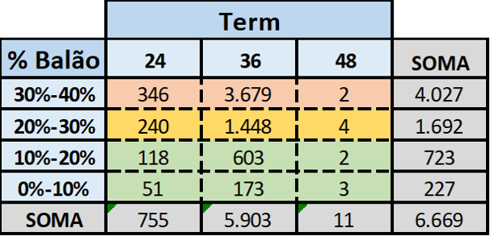

## Pacotes

```{r, message=FALSE}
library(tidyverse)
library(readxl)
library(knitr)
library(skimr)
```

## Dados

```{r, message=FALSE}
parcela_balao_grafico <- read_excel("../dados/Parcela_balao_grafico.xlsx", sheet = 1) %>%
  select(cta_contrato_p:Perc)
```

```{r}
glimpse(parcela_balao_grafico)
```

```{r, eval = FALSE}
# um pouco de vocabulario pra explorar um data.frame (tabela)
View(parcela_balao_grafico)

glimpse(parcela_balao_grafico)

names(parcela_balao_grafico)

head(parcela_balao_grafico)

tail(parcela_balao_grafico)

parcela_balao_grafico$vlr_venda

parcela_balao_grafico[10:20, 2:4]

table(parcela_balao_grafico$cta_qtd_parcelas_p)

unique(parcela_balao_grafico$cta_qtd_parcelas_p)

skim(parcela_balao_grafico)
```


## Gráfico de Barras

Vamos replicar o gráfico de barras da terceira aba da planilha `Parcela_balao_grafico.xlsx`

```{r, fig.height=1}

```


### Categorizando a coluna `Perc`

```{r}
parcela_balao_grafico <- parcela_balao_grafico %>%
  mutate(
    Perc_categ = cut(
      Perc, 
      breaks = c(0, 0.1, 0.2, 0.3, 0.4), 
      labels = c("0%-10%", "10%-20%", "20%-30%", "30%-40%"), 
      include.lowest = TRUE
    ),
    
    cta_qtd_parcelas_p = paste("Term", cta_qtd_parcelas_p)
  )
```

```{r}
parcela_balao_grafico %>% count(Perc_categ)
```


### Fazendo o gráfico com ggplot2

```{r}
# tabela para gerar o gráfico
tabela_perc_parc <- parcela_balao_grafico %>% 
  group_by(Perc_categ, cta_qtd_parcelas_p) %>%
  summarise(
    n = n()
  )
tabela_perc_parc
```


```{r}
tabela_perc_parc %>%
  ggplot(aes(x = Perc_categ, fill = cta_qtd_parcelas_p, y = n)) + # testar com fct_rev(Perc_categ)
  geom_col(position = "dodge") +
  geom_text(aes(label = n), position = position_dodge2(width = 0.9), vjust = -0.3) +
  theme(
    legend.position = "bottom"
  ) +
  labs(x = "", y = "", fill = "") +
  theme_minimal()
```

## Gráfico de Bolhas

Vamos fazer uma versão de gráfico de bolhas da tabela terceira aba da planilha `Parcela_balao_grafico.xlsx`

```{r, fig.height=1}

```

```{r}
tabela_perc_parc %>%
  mutate(
    Perc_categ_colour = fct_collapse(Perc_categ, "0%-20%" = c("0%-10%", "10%-20%"))
  ) %>%
  ggplot(aes(x = cta_qtd_parcelas_p, y = Perc_categ)) +
  geom_point(aes(size = n, colour = Perc_categ_colour), show.legend = FALSE) +
  geom_text(aes(label = n), color = "white") +
  scale_size_continuous(range = c(10, 30)) +
  theme_minimal()
```

